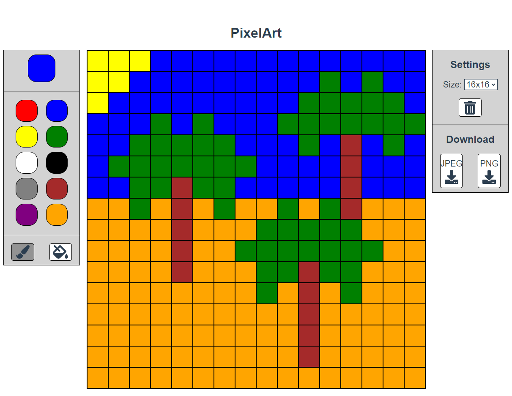

# PixelArt



## Used technologies / Frameworks

I use the following technologies / frameworks in my project:

- Vue.js (HTML, JavaScript, CSS)

I chose Vue.js because I already had made experience with this web-framework in my bachelor thesis. Also, this 
coding-challenge was a good chance to gather more experience in web development.

## Used 3rd Party Libraries

I use the following 3rd party libraries in my project:

Name | Reason
--- | ---
[dom-to-image](https://github.com/tsayen/dom-to-image) | For transforming a HTML-component into an image
[FileSaver.js](https://github.com/eligrey/FileSaver.js/) | For downloading the image that was created with 'dom-to-image'
[FontAwesome](https://fontawesome.com/) | For icons

## Installation / Run

The following components must be installed locally:

- [nodejs](https://nodejs.org/en/) v14.16.0
- [npm](https://nodejs.org/en/) v6.14.11
- [Vue.js](https://vuejs.org/) v3.2.4

To run the project locally, enter the following in the command line / bash:

```console
$ git clone https://github.com/RunningSmooth/PixelArt.git
$ cd PixelArt
$ cd client
$ npm install
$ npm run serve
```
---